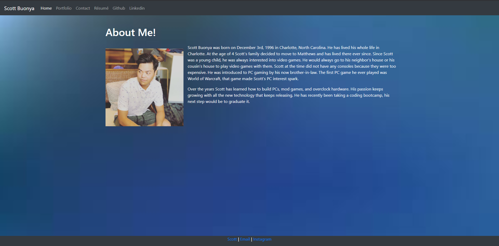
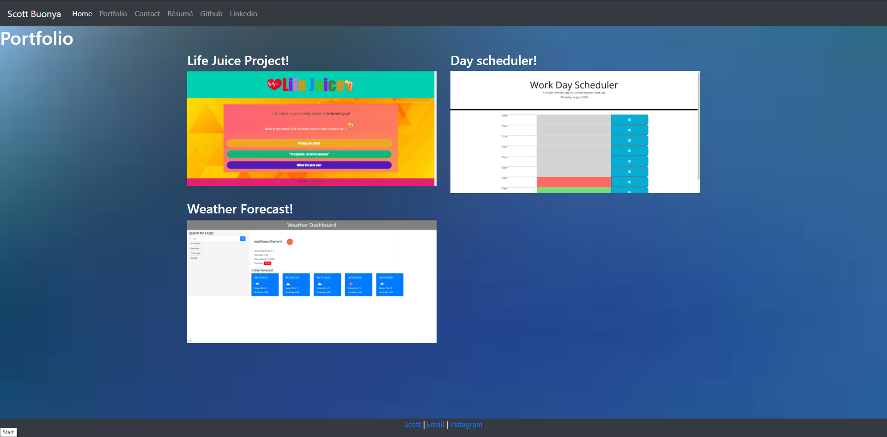

# HW_07_29
* This is my portfolio and about me web page that I will be updating through out the course.
* On my web page you can read about me, check out my portfolio, read my resume, link to my github and linkedin
* Here are the contents
    * contact.html
    * index.html
    * portfolio.html
    * style.css
    * images
    * Resume.pdf
* https://scottbuonya.github.io/Portfolio/

